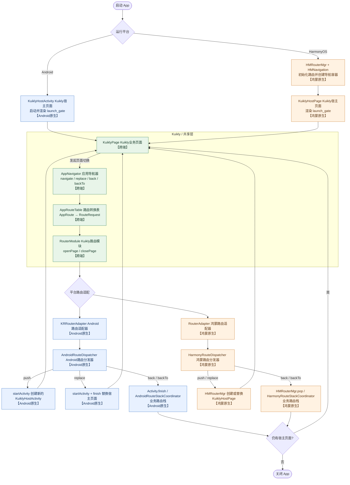

# CityCapsule Kuikly 跨端路由流程

```mermaid
flowchart TD
    START([启动 App])

    subgraph SHARED["Kuikly / 共享层"]
        KPAGE["KuiklyPage Kuikly业务页面<br/>【跨端】"]
        NAV["AppNavigator 应用导航器<br/>navigate / replace / back / backTo<br/>【跨端】"]
        TABLE["AppRouteTable 路由转换表<br/>AppRoute → RouteRequest<br/>【跨端】"]
        MODULE["RouterModule Kuikly路由模块<br/>openPage / closePage<br/>【跨端】"]
    end

    START --> PLATFORM{运行平台}

    PLATFORM -->|Android| AHOST["KuiklyHostActivity Kuikly宿主页面<br/>启动并渲染 launch_gate<br/>【Android原生】"]
    PLATFORM -->|HarmonyOS| HINIT["HMRouterMgr + HMNavigation<br/>初始化路由并创建导航容器<br/>【鸿蒙原生】"]
    HINIT --> HHOST["KuiklyHostPage Kuikly宿主页面<br/>渲染 launch_gate<br/>【鸿蒙原生】"]

    AHOST --> KPAGE
    HHOST --> KPAGE

    KPAGE -->|发起页面切换| NAV
    NAV --> TABLE --> MODULE
    MODULE --> ROUTE_PLATFORM{平台路由适配}

    ROUTE_PLATFORM --> AADAPTER["KRRouterAdapter Android路由适配器<br/>【Android原生】"]
    AADAPTER --> ADISPATCH["AndroidRouteDispatcher Android路由分发器<br/>【Android原生】"]
    ADISPATCH -->|push| ANEW["startActivity 创建新的KuiklyHostActivity<br/>【Android原生】"]
    ADISPATCH -->|replace| AREPLACE["startActivity + finish 替换宿主页面<br/>【Android原生】"]
    ADISPATCH -->|back / backTo| ABACK["Activity.finish / AndroidRouteStackCoordinator业务路由栈<br/>【Android原生】"]

    ROUTE_PLATFORM --> HADAPTER["RouterAdapter 鸿蒙路由适配器<br/>【鸿蒙原生】"]
    HADAPTER --> HDISPATCH["HarmonyRouteDispatcher 鸿蒙路由分发器<br/>【鸿蒙原生】"]
    HDISPATCH -->|push / replace| HNEW["HMRouterMgr 创建或替换KuiklyHostPage<br/>【鸿蒙原生】"]
    HDISPATCH -->|back / backTo| HBACK["HMRouterMgr.pop / HarmonyRouteStackCoordinator业务路由栈<br/>【鸿蒙原生】"]

    ANEW --> KPAGE
    AREPLACE --> KPAGE
    ABACK --> RESULT{仍有宿主页面?}
    HNEW --> KPAGE
    HBACK --> RESULT

    RESULT -->|是| KPAGE
    RESULT -->|否| END([关闭 App])

    classDef shared fill:#E8F5E9,stroke:#287A55,color:#173B2A;
    classDef android fill:#E8F1FF,stroke:#3975C6,color:#17345C;
    classDef harmony fill:#FFF2E2,stroke:#C77828,color:#5B3513;
    class KPAGE,NAV,TABLE,MODULE shared;
    class AHOST,AADAPTER,ADISPATCH,ANEW,AREPLACE,ABACK android;
    class HINIT,HHOST,HADAPTER,HDISPATCH,HNEW,HBACK harmony;
```

图例：

- 绿色节点：Kuikly 与共享 Kotlin 代码【跨端】
- 蓝色节点：Android Activity、Intent 与平台路由栈【Android原生】
- 橙色节点：HarmonyOS HMRouter、ArkUI 宿主与平台路由栈【鸿蒙原生】

